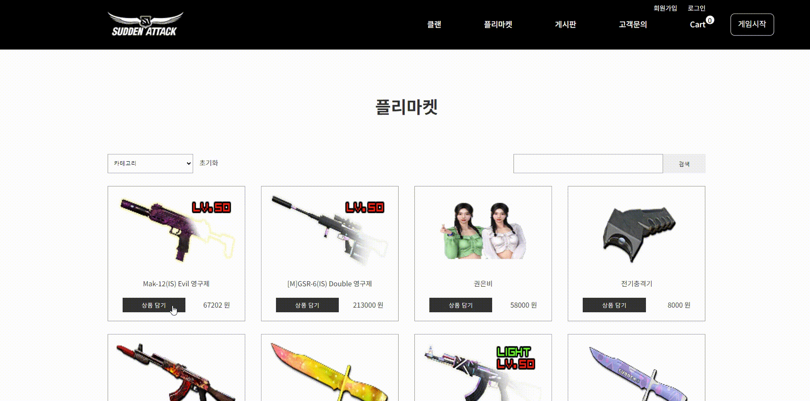
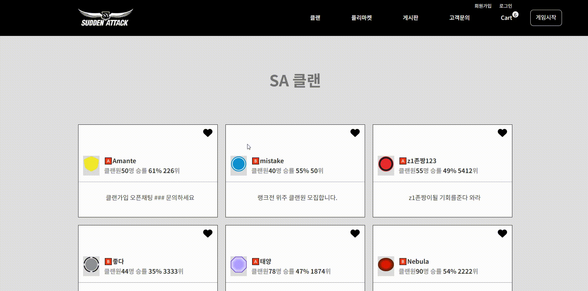
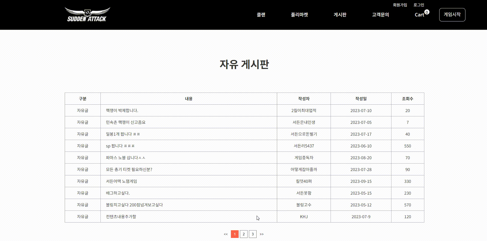
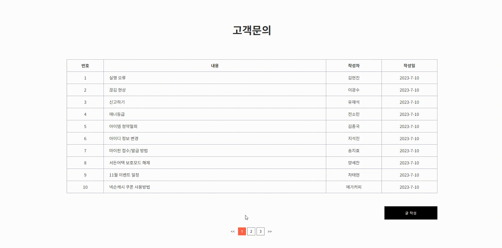

# 🖥️ 서든어택 사이트 리뉴얼 프로젝트

> **이름**: 김현진  
> **Github**: [0515khj](https://github.com/0515khj)  
> **작업 사항**: 메인, 클랜, 게시판, 고객문의, 장바구니 페이지 전반 설계 및 구현  

---

## 🛠️ 사용 기술  
- [x] **React**  
- [x] **Styled-Components**  
- [x] **Axios**  
- [x] **React Router**  
- [x] **Redux-Toolkit**  

---

## 🚀 프로젝트 주요 기능  
1. **검색**: 제품명으로 빠르게 검색 가능  
2. **좋아요**: 클랜 페이지에서 좋아요 버튼 구현  
3. **정렬**: 제품 정렬 기능 (이름순, 가격순, 카테고리)  
4. **수량 관리**: 장바구니에서 수량 증가/감소  
5. **장바구니**: 상품 추가/삭제 및 장바구니 비우기  

---

## 🗂️ 프로젝트 작업 순서  
1. **리뉴얼 대상 선정**: 서든어택 웹사이트 리뉴얼  
2. **디자인 수정**: 페이지별 디자인 개선 및 기능 추가  
3. **기술 스택 활용**: React / Styled-Components / Redux-Toolkit 적용  

---

# 📄 프로젝트 기능 상세

### 🌟 1. Product Page
- 제품 정렬 기능: **제품명**, **가격순**, **카테고리**별로 정렬  
- 초기화 기능 구현  
- **검색 기능**: 제품명을 기준으로 검색 가능  
- **장바구니 추가**: 상품 담기 클릭 시 수량이 장바구니에 추가  

---

### 🌟 2. Clan Page
- **좋아요 기능**: 클랜 항목에 좋아요 버튼 추가  

---

### 🌟 3. Notice Page
- **페이지네이션(Pagination)** 구현  
- **상세 보기**: 공지사항 내용을 클릭하면 상세 페이지로 이동  

---

### 🌟 4. Customer Service Page
- **글 작성 기능**: 고객 문의 글 작성 가능  
- **수정/삭제 기능**: 작성된 글 수정 및 삭제  
- **Pagination 구현**: 페이지네이션 기능 추가  

---

### 🌟 5. Cart Page
- **수량 증가/감소**: 장바구니 내 제품 수량 관리  
- **삭제 버튼**: 장바구니에서 특정 상품 삭제  
- **장바구니 비우기**: 전체 상품 삭제 기능  
- **선택 상품 삭제**: 선택한 상품만 삭제 가능  

---

### 🌟 6. Home Page
- **메인 페이지**: 사이트 메인 홈  

---

## 🎨 프로젝트 요약  
서든어택 웹사이트의 리뉴얼 프로젝트로, **사용자 친화적인 디자인**과 **효율적인 기능 구현**에 초점을 맞추어 작업했습니다.  
React를 사용하여 성능 최적화를 수행하였으며, 사용자 경험(UX)을 극대화한 결과물을 제공합니다.
