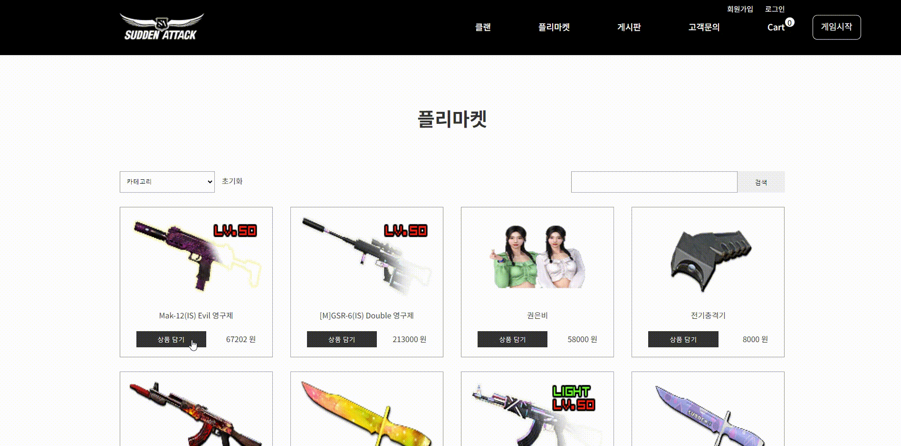
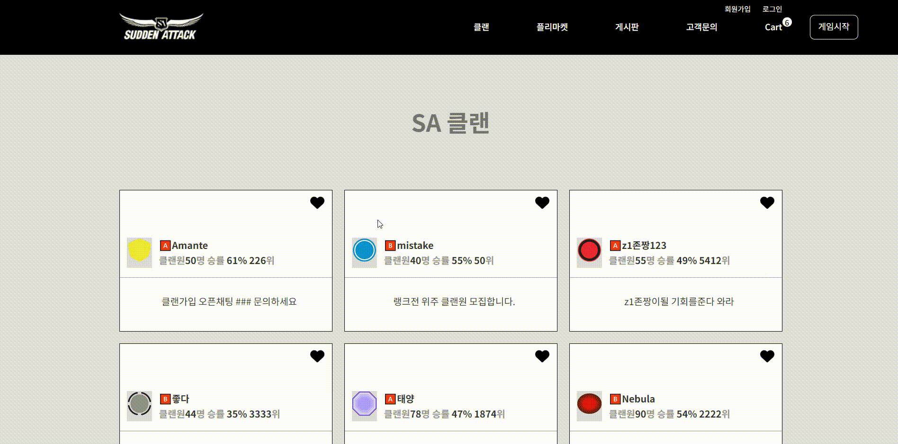
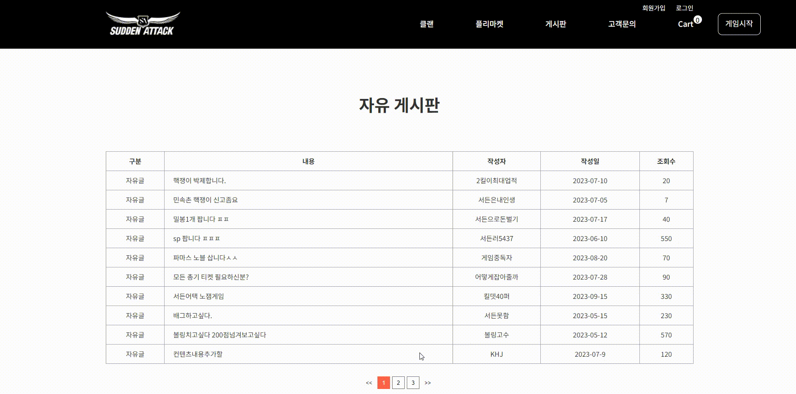
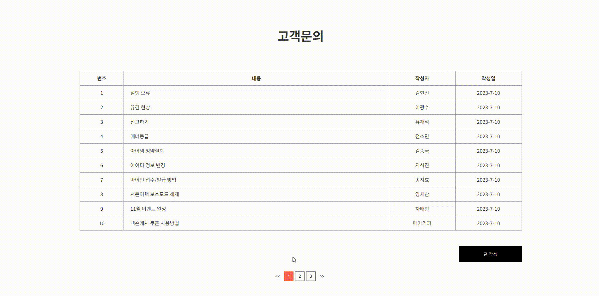
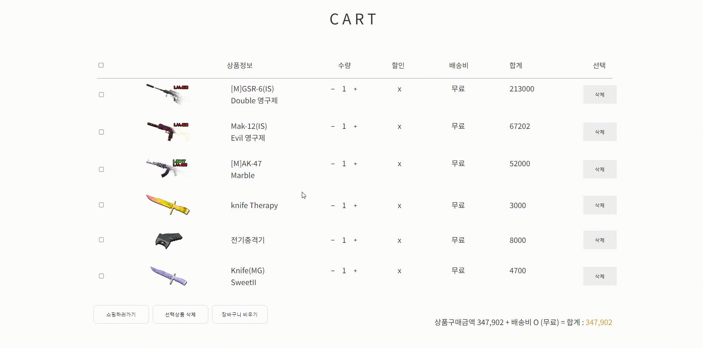

# 사이트 홈페이지 제작

|             | 이름   | Github                                  | 작업사항                                                                                                                                                                                                                                                                                                                             |
| :---------- | :----- | :-------------------------------------- | :----------------------------------------------------------------------------------------------------------------------------------------------------------------------------------------------------------------------------------------------------------------------------------------------------------------------------------- |
|       | 김현진 | 0515khj |메인 클랜 게시판 고객문의 장바구니  

# 서든어택 사이트

 
 

# 사용 기술  

- [x] React
- [X] Styled-Components
- [X] Axios 
- [X] Router 
- [X] Redux-toolkit

## 프로젝트 주요 기능
1. 검색
2. 좋아요
3. 정렬
4. 수량
5. 장바구니

## 프로젝트 작업 순서
1. 리뉴얼 웹 사이트 선정
2. 페이지 리뉴얼 및 디자인 수정
3. React  / Styled-Components / Redux-toolkit

# 프로젝트 기능 구현

### 1) Product page

* 제품 정렬 기능 구현( 제품명 , 가격순 , 카테고리)
* 초기화 기능 구현
* 제품명 검색 기능 구현
* 상품 담기 클릭하면 Cart에 수량 추가

### 2) Clan page

* 좋아요 기능 구현

### 3) Notice page

* Pagination 구현
* 내용 클릭시 상세 페이지로 이동

### 5) Customer service page

* 내용 클릭시 상세 페이지로 이동
* 수정 , 삭제 버튼 기능 구현
* 글작성 기능 구현
* Pagination 구현

### 6) Cart page

* 수량 증가 감소 구현
* 삭제 버튼 구현
* 장바구니 비우기  버튼 구현
* 선택 상품 삭제(예정) [완료]
* 전체 선택(예정)

### 7) Home page

